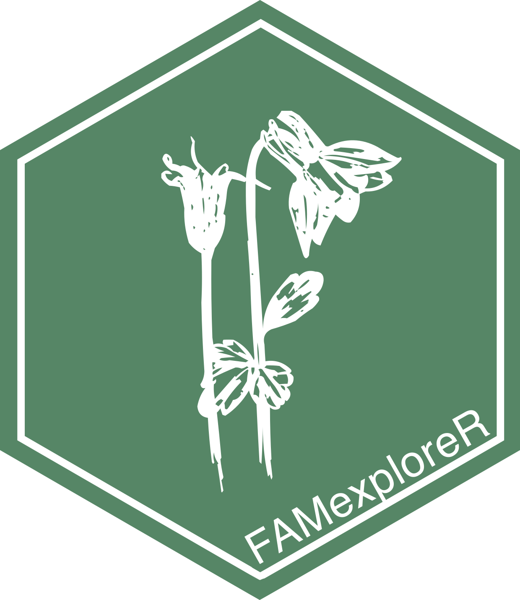

<!-- README.md is generated from README.Rmd. Please edit that file -->

# <span style="color:#588666">famexploreR</span> 

<!-- badges: start -->

[](https://www.repostatus.org/#active)
[](https://www.gnu.org/licenses/gpl-3.0)
[](https://doi.org/10.5281/zenodo.3697818)
<!-- badges: end -->

[famexploreR](https://ajpelu.github.io/famexploreR/) es un flujo de
trabajo pensado para facilitar del seguimiento de flora amenazada por
parte del personal técnico de la administración, así como la gestión de
la información recopilada en campo y la generación de diversos informes
a partir de dicha información.

El flujo de trabajo está compuesto por funciones específicas
desarrolladas en R y una aplicación desarrollada con shiny. La
aplicación permite el cómputo de diferentes variables e índices (riqueza
y diversidad vegetal; análisis de vecindad; exploración de rasgos
biológicos y reproductivos), así como la visualización espacial de los
datos de seguimiento. El formato modular de famexploreR permite
incorporar nuevos módulos en función de las necesidades demandadas por
los técnicos y gestores encargados de la conservación.

La aplicación permite que técnicos y agentes de medio ambiente, sin
necesidad de conocimientos específicos de estadística o programación,
puedan generar de manera rápida y sencilla gráficos e informes de los
seguimientos de las especies amenazadas, que pueden ser utilizados para
planificar actuaciones de gestión.

## Instalación

Puedes instalar la versión de desarrollo de famexploreR desde GitHub con
el siguiente código:

``` r
# install.packages("devtools")
devtools::install_github("ajpelu/famexploreR")
```

**famexploreR** fue construido en [R](https://www.r-project.org), un
lenguaje de programación de código abierto, utilizando el paquete
[Shiny](https://shiny.rstudio.com), un marco de aplicación web para R.

Puedes descargar la versión de desarrollo de **famexploreR** desde
[GitHub](https://github.com/ajpelu/famexploreR).

## Cómo ejecutar famexploreR

La opción recomendada para utilizar la aplicación es descargar el
paquete y ejecutarlo localmente.

### Localmente

1.  Se recomienda el uso de Rstudio.

2.  Descarga e instala el paquete `famexploreR` usando:

``` r
# install.packages("devtools")
devtools::install_github("ajpelu/famexploreR")
```

3.  Ejecuta la aplicación:

``` r
library("famexploreR")
launch_famexplorer()
```

### Live

También se puede instalar el paquete en un servidor que contenga
R-studio y shiny. De forma provisional se muestra un ejemplo
[aquí](http://vlab.iecolab.es/ajpelu/famexploreR/)

Todo el código necesario se encuentra en este
[repositorio](https://github.com/ajpelu/famexploreR)
