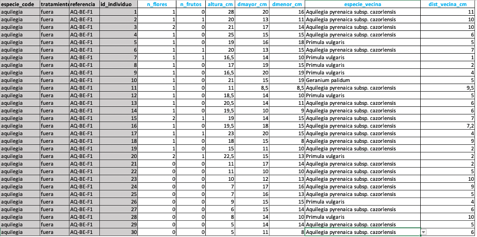

```{r, include = FALSE}
knitr::opts_chunk$set(
  message = FALSE,
  warning = FALSE,
  fig.height = 6,
  fig.width = 6,
  fig.align = "center",
  echo = FALSE,
  collapse = TRUE,
  comment = "#>"
)

options(rmarkdown.html_vignette.check_title = FALSE)
set.seed(123)
```

```{r setup, echo=FALSE}
library(famexploreR)
```

Para introducir los datos que se toman en campo, se ha diseñado un **formulario de campo** (estadillo de campo) a modo de hoja de cálculo (en formato `.xlsx` y `.ods`). A partir de las indicaciones proporcionadas y el diseño preliminar del estadillo de toma de datos en realiza la toma de datos en campo, pueda introducir los datos de forma lo más similar a como se toman los datos en campo.

# Características del formulario de campo

El formulario de campo proporcionado se denomina `ficha_campo.xlsx` o `ficha_campo.ods`.

Cada uno de los archivos (formularios de campo) han de nombrarse de una forma conveniente intentando evitar tíldes, carácteres especiales, espacios en blanco, etc. A modo de sugerencia, por ejemplo si se toman datos de una población de *Aquilegia pyrenaica cazorlensis* dentro de un vallado en una determinada localidad y fecha, se podría llamar al archivo **`20231101_AQ_BE_F1.xlsx`**, donde:

-   `20231101` correspondería a la fecha.

-   `AQ` se refiere al código que se emplee para la especie.

-   `BE` es el código de la localidad.

-   `F1` se refiere al transecto 1 *fuera* de vallado.

Nombrar de forma consistente a los ficheros de datos ayuda a la consistencia a la hora de realizar incorporaciones masivas de datos en posteriores aplicaciones.

# Formato del formulario de campo

El formulario de campo proporcionado se presenta en dos formatos:

-   `xlsx`: para uso en Microsoft Office
-   `ods`: para uso en OpenOffice Estos dos formatos son aceptados por la aplicación desarrollada.

# Estructura del formulario de campo

El formulario de campo contiene diferentes hojas de entrada de datos. En su versión actual consta de las siguientes hojas de entrada de datos: ***datos_generales***, ***suelo***, ***humedad_temp***, ***excrementos***, ***especie_focal***, ***herbivoria***, ***vecindad***, ***com_veg_cobertura***, y ***com_veg_contactos***. Asimismo consta de diferentes diccionarios de datos que se utilizan en las hojas de entrada de datos. Entre ellos tenemos: ***dicc_taxon***, ***dicc_tratamiento***, ***dicc_vallado***, ***dicc_estado_vallado***, y ***dicc_crs***.

## Diccionario de datos

### *dicc_taxon*

Diccionario de taxones derivado de Lista patrón de las especies silvestres presentes en España, del Ministerio para la Transición Ecológica y el Reto demográfico) (Figura \@ref(fig:dicctaxon)).

```{r dicctaxon}
#| fig.cap: "Diccionario de taxones"
#| fig.height: 10
#| fig.width: 20

knitr::include_graphics('figures/dicc_taxon.png')
```

### *dicc_tratamiento*

Diccionario de tratamientos para indicar si es dentro de vallado o fuera de vallado. Se pueden incluir nuevos registros a este diccionario. Consta de tres campos:

-   ***id_trat***: identificador único
-   ***tratamiento***: código de tratamiento
-   ***descripción***: descripción del tratamiento

### *dicc_vallado*

Diccionario para describir el tipo de vallado. Se pueden incluir nuevos registros a este diccionario. Consta de tres campos:

-   ***id_vallado***: identificador único

-   ***vallado***: código del vallado

-   ***descripción***: descripción del vallado

### *dicc_estado_vallado*

Diccionario para describir el estado del vallado. Se pueden incluir nuevos registros a este diccionario. Consta de tres campos:

-   ***id_estado_vallado***: identificador único

-   ***estado_vallado***: descripción del estado del vallado

### *dicc_crs*

Contiene una descripción de los diferentes sistemas de referencia de coordenadas (***CRS***, *Coordinate Reference Systems*, por sus siglas en inglés) que pueden ser utilizados en el territorio Peninsular. No se pueden incluir nuevos registros a este diccionario. Consta de los siguientes campos (Figura \@ref(fig:dicccrs)).:

-   ***id_crs***: identificador único para el sistema de referencia de coordenadas.

-   ***crs_code***: En esta columna se muestra el código o número asociado al sistema de referencia de coordenadas. Estos códigos son comunes en el campo de la cartografía, y suelen ser utilizados para identificar de manera única un CRS en particular.

-   ***crs_name***: nombre descriptivo del sistema de referencia de coordenadas. Este nombre proporciona información sobre el tipo o la naturaleza del CRS y, a menudo, incluye detalles sobre la proyección o el elipsoide utilizado en el sistema.

-   ***crs_url***: url o enlace que puede llevar a más información detallada sobre el sistema de referencia de coordenadas. Para cada crs se proporciona el código ***EPSG*** (*European Petroleum Survey Group*) como parte de la URL, lo que facilita la búsqueda de información adicional en bases de datos de referencia geoespacial.

```{r dicccrs}
#| fig.cap: "Diccionario de taxones"
#| fig.height: 10
#| fig.width: 20


```

## Entrada de *datos generales*

Se trata de la primera entrada de datos del formulario de campo (Figura \@ref(fig:entradagenerales)). En ella se introducen datos generales sobre el sitio, la población, el tratamiento, etc. En la siguiente tabla se describen cada uno de los campos, su tipología y los valores que aceptan.

| Nombre del campo                   | Descripción                                                                                                                                                                                 | Tipo                                                            |
|------------------|------------------------------------|------------------|
| *especie focal*                    | Especie a la que se le realiza el seguimiento                                                                                                                                               | Texto. Procedente de una lista controlada (dicc_taxon)          |
| *code*                             | Código de la especie. Definido por el usuario                                                                                                                                               | Texto. No tíldes. No caracteres especiales.                     |
| *site*                             | Código de sitio. Definido por el usuario                                                                                                                                                    | Alfanumérico                                                    |
| *poblacion*                        | Número de población                                                                                                                                                                         | Numero Entero                                                   |
| *tratamiento*                      | Tipo de tratamiento                                                                                                                                                                         | Texto. Procedente de una lista controlada (dicc_tratamiento)    |
| *transecto*                        | Número del transecto                                                                                                                                                                        | Numero Entero                                                   |
| *reference*                        | Código automático generado por la combinación de varios campos                                                                                                                              | No modificable por el usuario                                   |
| *fecha*                            | Fecha de visita                                                                                                                                                                             | Fecha. Formato AAAAMMDD (AñoMesDia)                             |
| *localidad*                        | Nombre de la localidad                                                                                                                                                                      | Texto                                                           |
| *elevacion*                        | Elevación                                                                                                                                                                                   | Entero                                                          |
| *coord_x*                          | Coordenada X                                                                                                                                                                                | Entero                                                          |
| *coord_y*                          | Coordenada Y                                                                                                                                                                                | Entero                                                          |
| *crs*                              | Código de la proyección CRS                                                                                                                                                                 | Alfanumérico. Procedente de una lista controlada (dicc_crs)     |
| *archivo_coordenadas*              | Existencia de archivo de coordenadas                                                                                                                                                        | SI / NO                                                         |
| *vallado_tipo*                     | Tipo de vallado                                                                                                                                                                             | Texto. Procedente de una lista controlada (dicc_vallado)        |
| *vallado_year*                     | Año de instalación del vallado                                                                                                                                                              | Entero                                                          |
| *vallado_perimetro*                | Perímetro del vallado                                                                                                                                                                       | Numérico                                                        |
| *vallado_altura*                   | Altura del vallado                                                                                                                                                                          | Numérico                                                        |
| *vallado_estado*                   | Estado del vallado                                                                                                                                                                          | Texto. Procedente de una lista controlada (dicc_estado_vallado) |
| *comunidad_vegetal*                | Tipología del muestreo utilizado en la caracterización de la comunidad vegetal. En función de la elección se ha de rellenar la hoja correspondiente (com_veg_cobertura o com_veg_contactos) | Lista. Opciones: método cobertura método contactos              |
| *dimensiones_parcela_comunidad_m2* | Dimensiones (área) de la parcela si se utiliza el método de muestreo de cobertura                                                                                                           | Numérico                                                        |
| *longitud_transecto_m*             | Longitud del transecto en m, si se utiliza el método de contactos                                                                                                                           | Numérico                                                        |
| *separacion_segmentos_m*           | Separación de los segmentos en los que se realizan los contactos. Metodo de contacto                                                                                                        | Numérico                                                        |
| *puntos_segmento*                  | Número de puntos de contacto. Método de Contacto                                                                                                                                            | Numérico                                                        |
| *diametro_muestreo_vecindad_cm*    | Dimensiones (diámetro) del plot del muestreo de vecindad                                                                                                                                    |                                                                 |

: Descripción de los campos de la hoja de entrada de Datos Generales

```{r entradagenerales}
#| fig.cap: "Vista de la hoja de entrada de datos generales" 
#| fig.height: 10
#| fig.width: 20

knitr::include_graphics('figures/entrada_datos.png')
```

## Entrada de *datos de suelo*

Hoja del formulario para introducir datos de parámetros físico-químicos del suelo (Figura \@ref(fig:entradasuelos)). En cada fila se introducirán los datos de una muestra de suelo. Los primeros campos, sombreados en gris, se rellenan automáticamente al incluir una nueva fila de datos. Estos campos proceden de los datos introducidos en la primera hoja de datos. Así que cualquier cambio en la primera hoja de datos afecta al resto de las hojas del formulario.\
Actualmente ésta hoja de datos contiene unos determinados parámetros (pH, % limo, Materia Orgánica, Conductividad Eléctrica, etc), pero se pueden incluir más a futuro.

```{r entradasuelos}
#| fig.cap: "Vista de la hoja de entrada de datos de suelo" 

knitr::include_graphics('figures/entrada_datos_suelo.png')
```

## Entrada de *datos de humedad y temperatura del suelo*

Hoja del formulario para introducir datos de parámetros de temperatura y humedad del suelo (Figura \@ref(fig:entradatemperatura)). En cada fila se introducirán los datos de humedad y temperatura de cada punto del suelo. Los primeros campos, sombreados en gris, se rellenan automáticamente al incluir una nueva fila de datos. Estos campos proceden de los datos introducidos en la primera hoja de datos.

```{r entradatemperatura}
#| fig.cap: "Vista de la hoja de entrada de datos de temperatura y humedad del suelo" 


```

## Entrada de *datos de excrementos*

Hoja del formulario para introducir datos de los excrementos (Figura \@ref(fig:entradaexcrementos)). Solamente se pueden introducir datos en dos campos:

-   ***superficie_m2***: la superficie en la que se han contabilizado los excrementos
-   ***excrementos_n***: número de excrementos o grupos de excrementos contabilizados.

El campo ***excrementos_m2*** se calcula automáticamente. Los primeros campos, sombreados en gris, se rellenan automáticamente. Estos campos proceden de los datos introducidos en la primera hoja de datos.

```{r entradaexcrementos}
#| fig.cap: "Vista de la hoja de entrada de datos de temperatura y humedad del suelo"

knitr::include_graphics('figures/entrada_datos_excrementos.png')
```

## Entrada de *datos de la especie focal*

Hoja del formulario para introducir diferentes datos biométricos, de floración, etc de la especie focal (Figura \@ref(fig:entradafocal)). Esta hoja contendrá un máximo de 30 filas (aunque en algunos casos en los que existan menos individuos se rellenarán menos filas). <br>

Para cada uno de los individuos de la especie focal se toman diferentes parámetros:

-   ***n_flores***: número de flores.

-   ***n_frutos***: número de frutos.

-   ***altura_cm***: altura en cm.

-   ***dmayor_cm***: diámetro mayor en cm.

-   ***dmenor_cm***: diámetro menor en cm.

Asimismo, para cada individuo se indica la especie vecina más próxima (***especie_vecina***) y indica la distancia en cm a la que se encuentra (***dist_vecina_cm***). Para cada fila (cada individuo de la especie focal), la especie vecina se elige de una lista controlada que viene del diccionario de taxones. Los primeros campos, sombreados en gris, se rellenan automáticamente. Estos campos proceden de los datos introducidos en la primera hoja de datos.

```{r entradafocal}
#| fig.cap: "Vista de la hoja de entrada de datos de la especie focal"


```

## Entrada de *datos de herbivoría*

Hoja del formulario para introducir datos de daños por herbivoría en la especie focal (Figura \@ref(fig:entradaherbivoria)). Para cada individuo de la especie focal (*id_individuo*) se eligen cinco hojas (*hoja*) y se indica el porcentaje de daño por herbivoría (*pct_comido*) utilizando una escala. Esta hoja contendrá como máximo de 50 filas (5 hojas por 10 individuos), aunque en algunos casos en los que existan menos individuos se rellenarán menos filas. Los primeros campos, sombreados en gris, se rellenan automáticamente. Estos campos proceden de los datos introducidos en la primera hoja de datos.

```{r entradaherbivoria}
#| fig.cap: "Vista de la hoja de entrada de datos de herbivoría de la especie focal"

knitr::include_graphics('figures/entrada_datos_herbivoria.png')
```

## Entrada de *datos de vecindad*

Hoja del formulario para introducir datos de composición de especies en torno a la especie focal (Figura \@ref(fig:entradavecindad)). Se eligen 30 individuos de la especie focal, y en torno a ellos se muestrea un plot de un diámetro determinado (*diam_muestreo_vecindad_cm*). Este dato ya se introdujo en la hoja de datos generales y no es necesario rellenarlo. En cada plot se anota el individuo de la especie focal (columna *individuo)*, y dentro de ese plot se indican las especies vecinas (*especie_vecina*) y su número (*n_vecino*). Las especies vecinas se eligen de una lista controlada que viene del diccionario de taxones. Los primeros campos, sombreados en gris, se rellenan automáticamente. Estos campos proceden de los datos introducidos en la primera hoja de datos.

```{r entradavecindad}
#| fig.cap: "Vista de la hoja de entrada de datos de vecindad de la especie focal"

knitr::include_graphics('figures/entrada_datos_vecindad.png')
```

## Entrada de datos de composición de la comunidad vegetal: método de cobertura (*com_veg_cobertura*)

Hoja del formulario para introducir datos de la composición de la comunidad (Figura \@ref(fig:entradacobertura)). Esta hoja solamente se rellenará en caso de haber seleccionado en la hoja general de datos el *método cobertura* dentro de la fila ***comunidad_vegetal.*** Si se rellena esta hoja no hay que rellenar la hoja *com_veg_contactos*.

```{r entradacobertura}
#| fig.cap: "Vista de la hoja de entrada de datos de la comunidad comunidad vegetal por el método de cobertura"

knitr::include_graphics('figures/entrada_datos_cobertura.png')
```

Se rellenarán tantas filas como especies se identifique dentro del polígono de muestreo. Las dimensiones del polígono de muestreo (*columna dimensiones_m2*) se han incluido en la pestaña inicial de datos, y no es necesario rellenarla aquí. <br> 
Las especies identificadas se eligen de una lista controlada que viene del diccionario de taxones. Para cada especie se indica el porcentaje de cobertura. <br> 
Asimismo en la última columna se indica el % de cobertura general de la parcela. Solamente se indica en la primera fila, el resto de filas se rellenan automáticamente. Los primeros campos, sombreados en gris, se rellenan automáticamente. Estos campos proceden de los datos introducidos en la primera hoja de datos.

## Entrada de datos de composición de la comunidad vegetal: método de contactos (*com_veg_contactos*)

Hoja del formulario para introducir datos de la composición de la comunidad (Figura \@ref(fig:entradacontactos)). Esta hoja solamente se rellenará en caso de haber seleccionado en la hoja general de datos el *método contacto* dentro de la fila ***comunidad_vegetal.*** Si se rellena esta hoja no hay que rellenar la hoja *com_veg_cobertura*.

```{r entradacontactos}
#| fig.cap: "Vista de la hoja de entrada de datos de la comunidad comunidad vegetal por el método de contactos"

knitr::include_graphics('figures/entrada_datos_contactos.png')
```

Se rellenarán tantas filas como especies se identifique dentro del polígono de muestreo. La longitud del transecto (columna *longitud_transecto_m*), la separación entre segmentos (columna *separación_segmento_m*) y el número de puntos por segmento (columna *puntos_por_segmento*) se han incluido en la pestaña inicial de datos, y no es necesario rellenarlos aquí. <br>
Las especies identificadas se eligen de una lista controlada que viene del diccionario de taxones. Para cada especie se indica el número de contactos totales (*n_contactos*) y con ello se calcula la cobertura de cada especie. Los primeros campos, sombreados en gris, se rellenan automáticamente. Estos campos proceden de los datos introducidos en la primera hoja de datos.
