```{r, include = FALSE}
knitr::opts_chunk$set(
  message = FALSE,
  warning = FALSE,
  fig.height = 6,
  fig.width = 6,
  fig.align = "center",
  echo = FALSE,
  collapse = TRUE,
  comment = "#>"
)

options(rmarkdown.html_vignette.check_title = FALSE)
set.seed(123)
```

## Instalar la app.

La opción recomendada para utilizar la aplicación es descargar el
paquete y ejecutarlo localmente. Para ello:

1.  Se recomienda el uso de Rstudio.

2.  Descarga e instala el paquete `famexploreR` usando el siguiente
    código. Este paso solamente es necesario una vez:

``` r
# install.packages("devtools")
devtools::install_github("ajpelu/famexploreR")
```

3.  Ejecuta la aplicación:

``` r
library("famexploreR")
launch_famexplorer()
```

No obstante, también es posible tener instalada la app en un servidor
que contenga R-studio y shiny. De forma provisional se muestra un
ejemplo [aquí](http://vlab.iecolab.es/ajpelu/famexploreR/).

## Inicializar la app

Una vez instalada, es necesario abrir R-studio y ejecutar el siguiente
comando:

``` r
library("famexploreR")
launch_famexplorer()
```

# Funcionamiento

Una vez abierta la aplicación, observamos dos grandes apartados (Figura
\@ref(fig:home)):

-   Módulo de carga de datos
-   Módulo de visualización y resultados

## Módulo de *Carga de datos*

En este apartado el usuario puede cargar dos tipologías de datos:

-   **Estadillo de campo**. El usuario elige el estadillo de campo
    relleno (en formato `.xlsx` u `.ods`) y se carga en la aplicación.

-   **Información espacial**. Archivos de información espacial
    (*shapefiles*). Es necesario cargar todos los archivos asociados al
    shapefile (no únicamente el `.shp`).

Asimismo, este módulo de carga de datos tiene otra opción para la
generación de informes (ver más adelante).

## Módulo de *Visualización de datos*.

Una vez cargados los dos tipos de datos se visualizan los diferentes
datos, tablas, gráficos, índices, etc derivados del procesamiento y
análisis de los mismos. Describimos a continuación cada uno de los
resultados que se visualizan.

```{r home}
#| fig.cap: "Vista de la pestaña Datos generales"

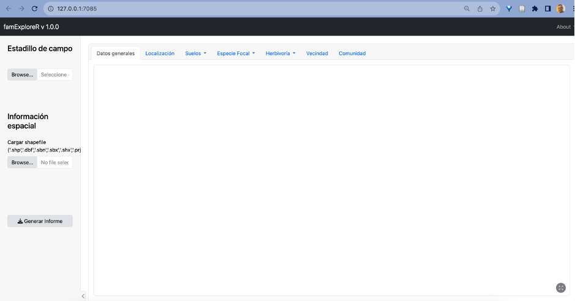
```

### Datos generales

En la pestaña datos generales se visualizan los metadatos del
formulario, referentes a la población estudiada, la fecha de la visita,
especie focal, etc. Un ejemplo de ello puede verse en la Figura
\@ref(fig:datosgenerales).

```{r datosgenerales}
#| fig.cap: "Vista de la pestaña Datos generales"

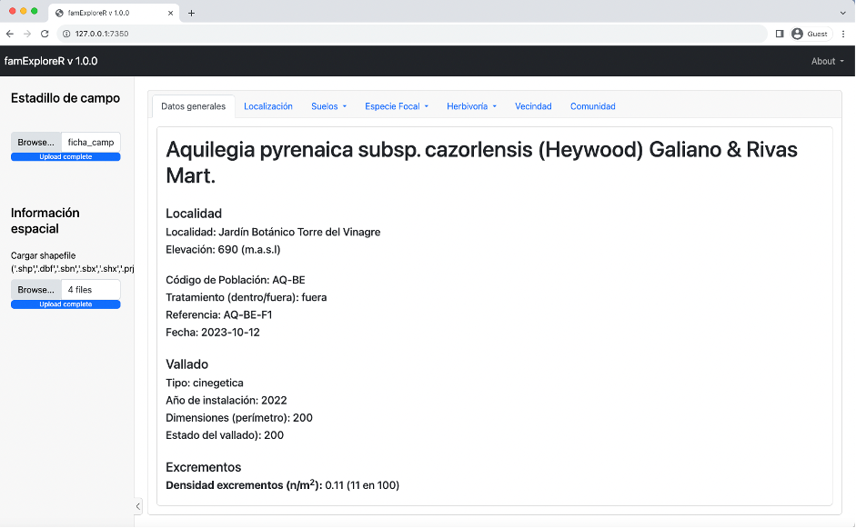
```

### Localización

En la pestaña localización (Figura
\@ref(fig:localiza)) se muestra un mapa con la localización de la
parcela, así como la representación espacial del polígono de la parcela
(siempre que se suba el archivo shapefile).

En el mapa desplegado se pueden utilizar diferentes mapas base
(seleccionándolo en la zona superior derecha del mapa):

-   Ortofoto
-   Curvas de Nivel
-   Topográfico
-   Mapa LIDAR
-   Mapa base Asimismo, también se puede ampliar el mapa pinchando en la
    zona inferior derecha.

```{r localiza}
#| fig.cap: "Vista de la pestaña Localización "

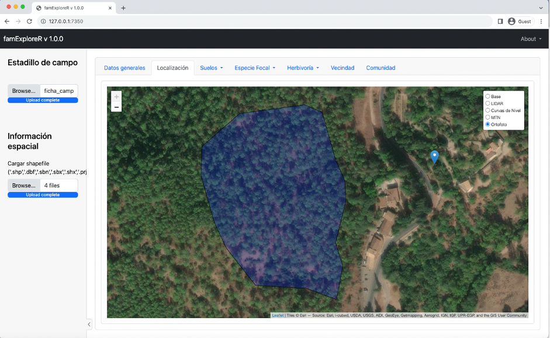
```

### Suelos 

En la pestaña suelos, se pueden observar dos subpestañas con información de diferentes clases: 

* Parámetros físico-químicos y de temperatura y humedad del suelo.
* Diagrama ternario.

En la primera subpestaña (*Parámetros*) se muestran unos estadísticos con
los parámetros del suelo contenidos en el formulario de campo, tal y
como se muestra en la Figura \@ref(fig:suelostabla). 

```{r suelostabla}
#| fig.cap: "Vista de la pestaña Parámetros de suelo"

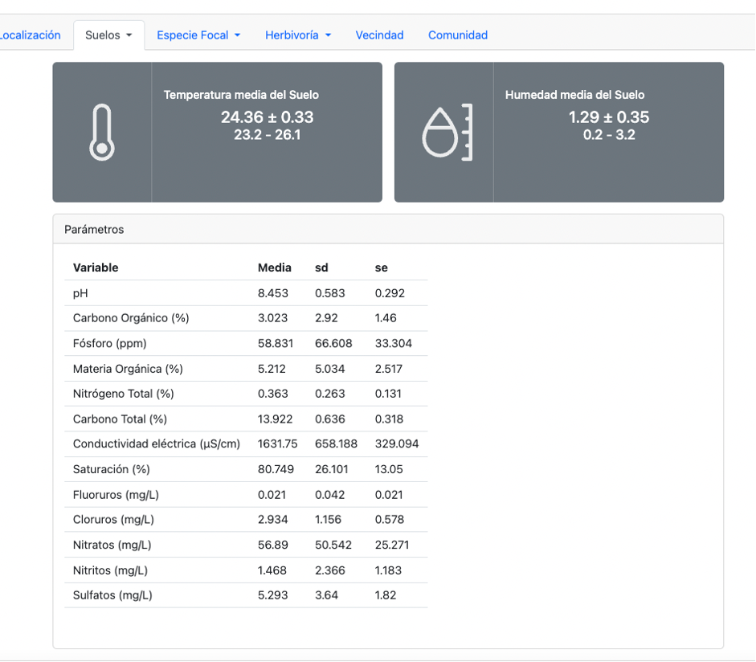
```

Para la temperatura y la humedad, se muestran valores medios y la
desviación estándar y los valores mínimos y máximos. Para el resto de
parámetros se muestran en formato tabla los estadísticos de media,
desviación estándar y error estándar de la media. <br>

En la subpestaña *diagrama ternario* se muestra una figura con la disposición de la
tipología del suelo en función del porcentaje de arcilla, limo y arena (Figura \@ref(fig:suelosternario)).

```{r suelosternario}
#| fig.cap: "Vista de la pestaña Diagrama ternario de las muestras de suelo. Cada punto representa una muestra de suelo"

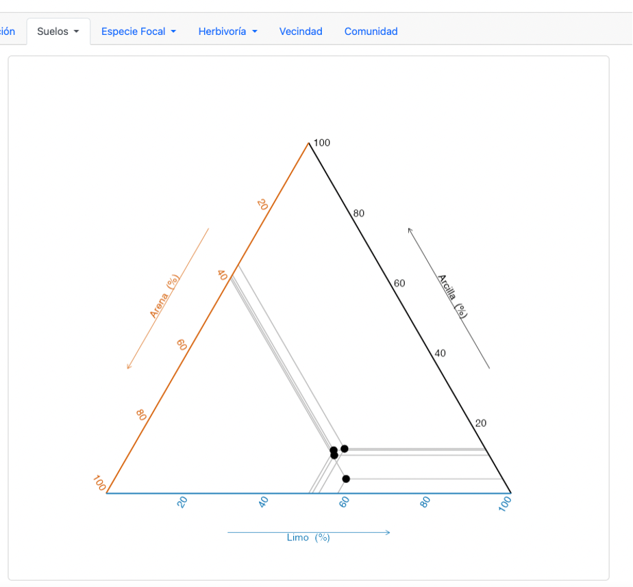
```


### Especie focal 

En la pestaña Especie focal, se pueden observar dos
subpestañas con información de diferentes clases:

* *Biometría de la especie focal*
* *Floración / Fructificación*

En el apartado de *Biometría de la especie focal*, se muestra en la parte
superior un gráfico con la distribución del diámetro mayor, menor y la
altura en cm de la especie focal (Figura \@ref(fig:biometria)).

```{r biometria}
#| fig.cap: "Vista de la pestaña Biometría"

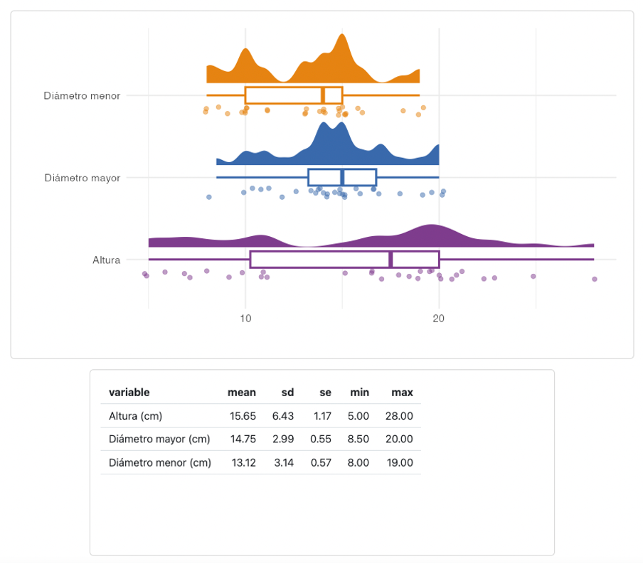
```

En la parte inferior aparece una tabla con los datos de la media,
desviación estándar, error estándar de la media, máximo y mínimo de cada
una de estas variables.

En la subpestaña *Floración / Fructificación*, se ofrecen dos gráficos (Figura \@ref(fig:fructifica)) que
nos aportan información sobre el % de individuos en flor y en fruto, así
como el promedio de flores y frutos de los individuos que presentan
flores y frutos respectivamente. Ese gráfico es interactivo.

```{r fructifica}
#| fig.cap: "Vista de la pestaña Floración / Fructificación."

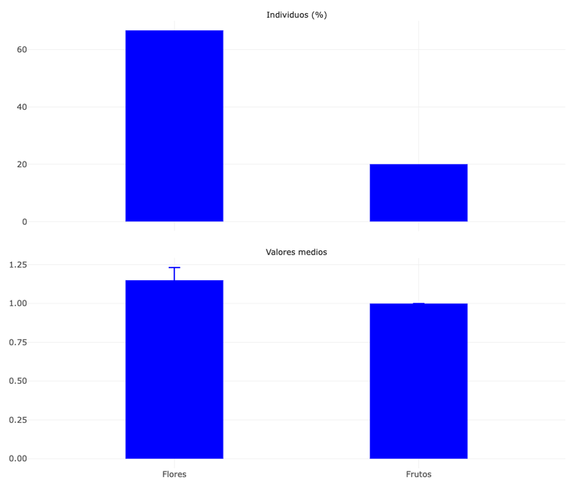
```

### Herbivoria 
En la pestaña Herbivoría se muestra la información calculada
sobre los individuos de dos formas diferentes, en formato tabla y en
formato gráfico ((Figuras \@ref(fig:herbivoriatabla) y \@ref(fig:herbivoriafigura)). En ambos casos se muestran para cada individuo el % de
hojas dañadas así como el daño medio (en %) y su desviación estándar y
el error estándar. Esa información también se puede visualizar como
gráfico interactivo.

```{r herbivoriatabla}
#| fig.cap: "Vista de la tabla de Herbivoría"

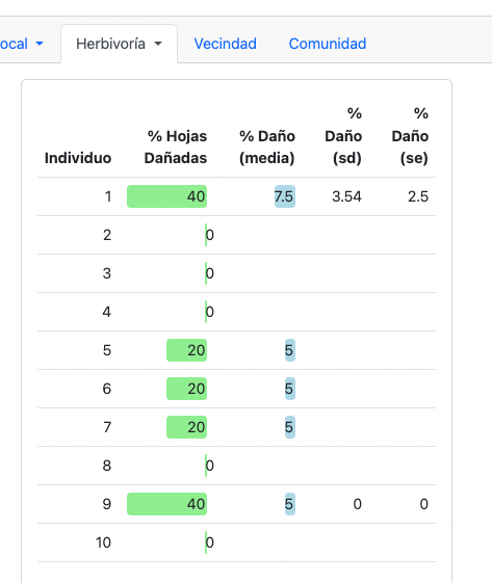
```

```{r herbivoriafigura}
#| fig.cap: "Vista de la gráfica interactiva de Herbivoría"

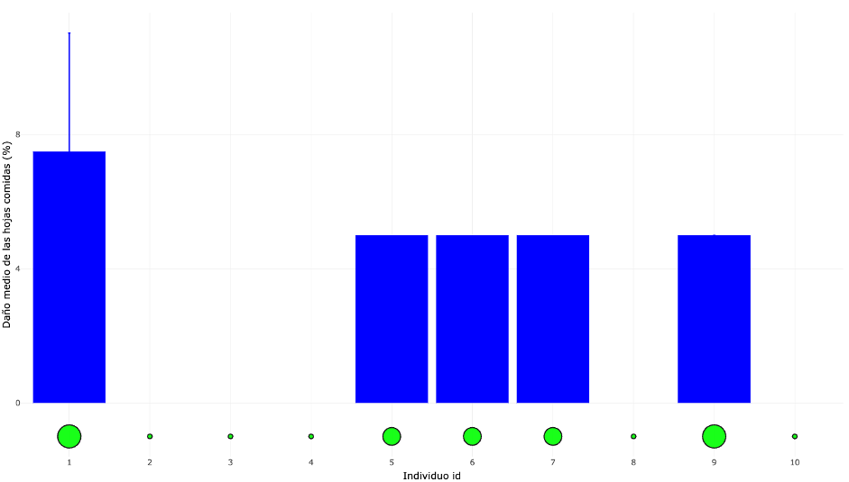
```

### Vecindad 

Usando los datos de las especies vecinas en los plots
circulares de 50 cm de diámetro se obtienen diferentes métricas que se
muestran en esta pestaña.

```{r vecindad}
#| fig.cap: "Vista de la gráfica pestaña de Vecindad"

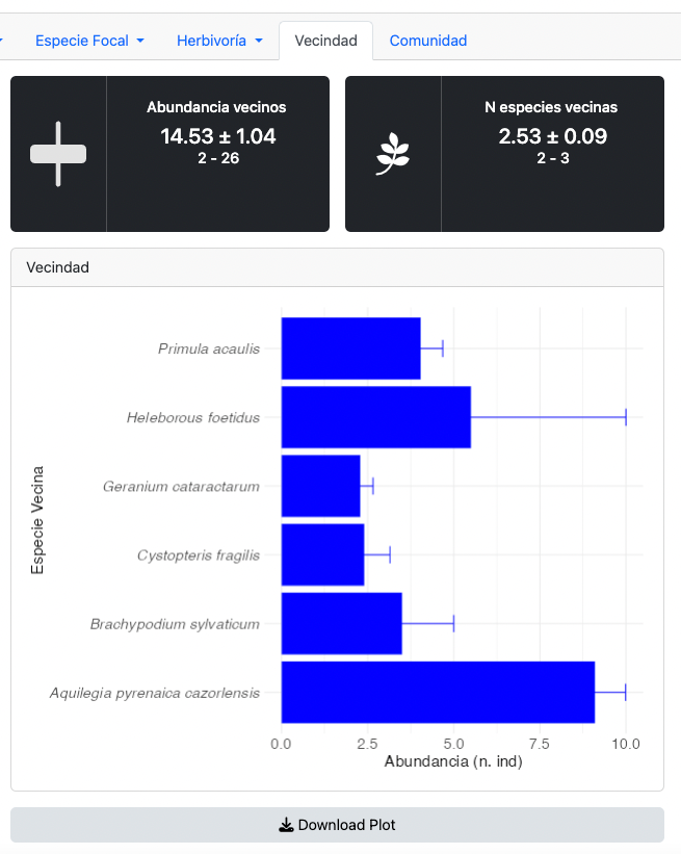
```


En la parte superior izquierda se visualizan la abundancia media de
vecinos (junto al error estándar) y el mínimo y máximo numero de vecinos
dentro de cada plot circular. Mientras que en la parte superior derecha
se muestra el número promedio de especies encontradas en cada plot (y el
mínimo y el máximo). En la parte inferior, en el gráfico, se muestra la
abundancia media para cada especie.

### Comunidad 
En la última pestaña, se muestran datos de la Comunidad, así como algunas métricas derivadas de la misma.

```{r comunidad}
#| fig.cap: "Vista de la pestaña Comunidad"

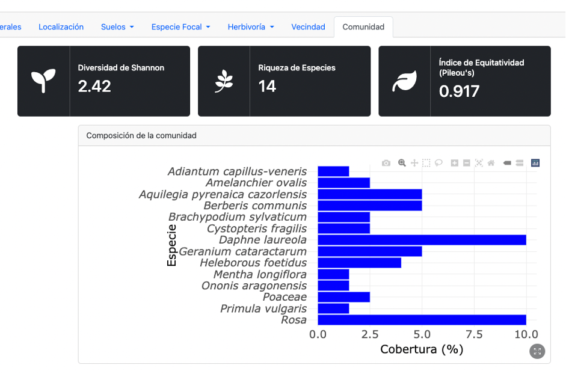
```

En la parte superior izquierda se visualizan la riqueza de especies, la
diversidad (medida con el índice de Shannon) y la equitatividad (medida
con el índice de Pielou). En la parte inferior se muestran, en un
gráfico interactivo, todas las especies observadas y la cobertura para
cada una de ellas. 

## Generación de informes 
En la parte inferior izquierda de la pantalla general, aparece una opción llamada Generar
Informe ((Figura \@ref(fig:home)). Al cliquear este botón se genera un informe en formato `.docx` con toda la información generada por la aplicación: cálculos, gráficos,
etc.

```{r informe}
#| fig.cap: "Vista del botón Generar Informe"

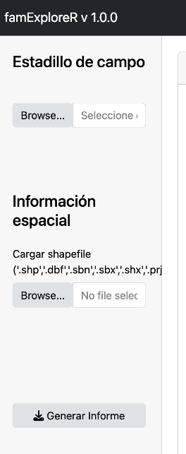
```

